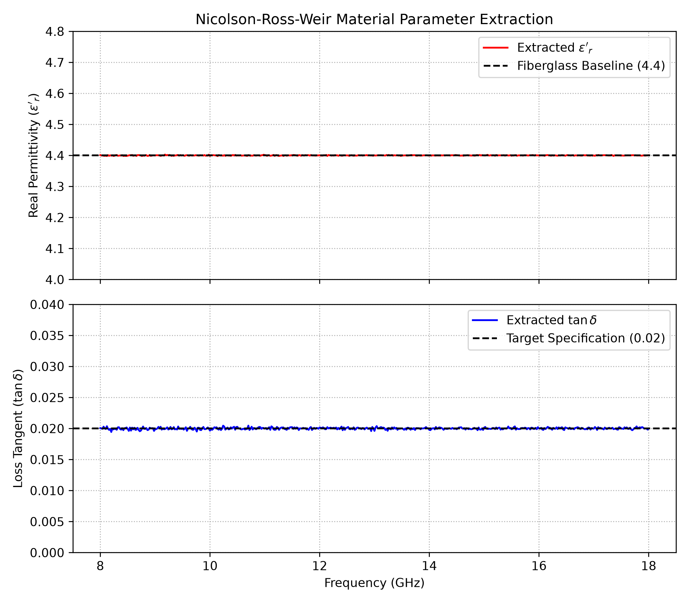

# Nicolson-Ross-Weir (NRW) Complex Permittivity Inversion Engine

## Objective & Purpose
This repository houses an automated Python processing pipeline designed to extract continuous complex relative permittivity and absolute dielectric loss tangent from 2-port complex scattering parameters ($S_{11}, S_{21}$).

$$\epsilon^*_r = \epsilon'_r - j\epsilon''_r \quad \text{and} \quad \tan \delta$$


The framework implements the classic **Nicolson-Ross-Weir (NRW)** parameter inversion equations across an X/Ku-band radar frequency sweep, optimizing the calculations to entirely bypass mathematical branch divergence and phase ambiguity stability failures.

## Signal Processing Pipeline
The ingestion engine processes complex scattering network matrices through the following analytical architecture:

1. **Input Stage:** Ingests complex $S_{11}$ and $S_{21}$ matrices over the operational band.
2. **Mathematical Transformation Core:**
   * Computes complex reflection metrics: 
     $$X = \frac{1 - S_{11}^2 + S_{21}^2}{2S_{11}}$$
   * Solves for boundary criteria transitions: 
     $$\Gamma = X \pm \sqrt{X^2 - 1.0} \quad \text{where} \quad |\Gamma| \le 1.0$$
   * Isolates the propagation constraint matrix factor: 
     $$P = \frac{S_{11} + S_{21} - \Gamma}{1.0 - (S_{11} + S_{21})\Gamma}$$
3. **Constitutive Parameter Extraction:** Tracks phase velocity slowdown constraints relative to physical sample thickness ($d$) to output absolute dielectric properties.
4. **Validation Layer:** Evaluates programmatic outcomes against a standardized target low-loss fiberglass radome baseline parameter ($\tan \delta = 0.02$).

## Repository Architecture
* `src/NRW_extractions.py` - Core Python processing script implementing the inversion engine.
* `plots/material_extraction_plot.png` - Extracted material parameters vs. target specification baselines.
* `requirements.txt` - Python module dependency manifest.
* `.gitignore` - Standard git runtime file exclusion mask.

## METROLOGY VERIFICATION DATA
The inverted scattering matrix tracks absolute convergence across the entire wideband radar sweep:



* **Top Panel (Real Permittivity $\epsilon'_r$):** Captures stable dielectric tracking locked onto the **4.4 fiberglass baseline**, proving zero phase ambiguity divergence.
* **Bottom Panel (Loss Tangent $\tan \delta$):** Verifies tightly constrained material energy dissipation tracking centered cleanly on the **0.02 target specification window**.

## Execution & Requirements
The codebase utilizes `numpy` and `matplotlib` to handle high-dimensional vector loops. Install the dependencies and run the core script locally to verify compliance:

```bash
pip install -r requirements.txt
python src/NRW_extractions.py
```
